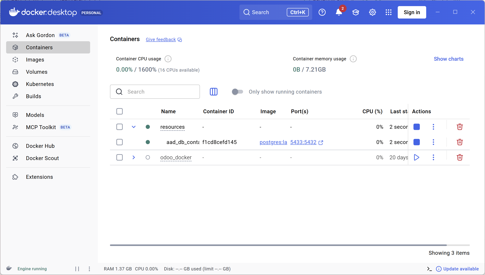
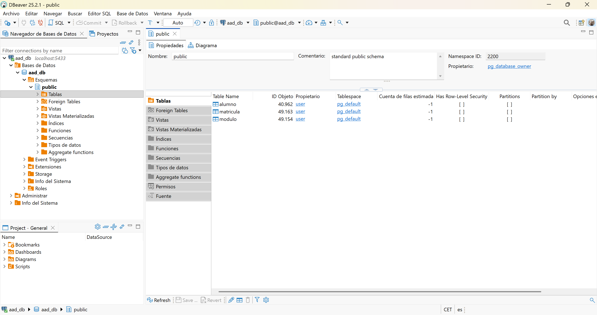
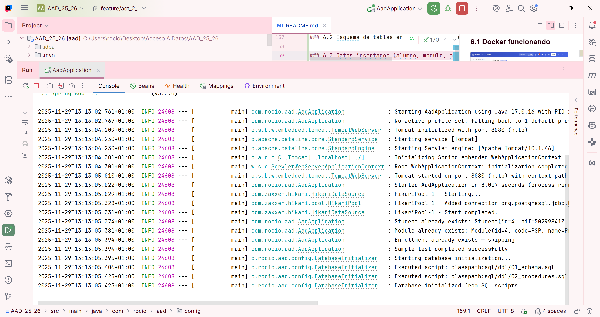

# Actividad 2.1. Gestión Académica con JDBC, PostgreSQL y Docker

Este proyecto implementa una aplicación completa de gestión académica
utilizando **Spring Boot**, **JDBC puro**, **PostgreSQL**,
**procedimientos almacenados**, **transacciones manuales**, y
**Docker**.\
Está desarrollado conforme a los requisitos de la práctica oficial de la
asignatura **Acceso a Datos (AAD)**.

------------------------------------------------------------------------

## Índice

1. [Descripción general](#descripción-general)
2. [Tecnologías utilizadas](#tecnologías-utilizadas)
3. [Estructura del proyecto](#estructura-del-proyecto)
4. [Configuración de la base de datos con
   Docker](#configuración-de-la-base-de-datos-con-docker)
5. [Inicialización automática de la base de
   datos](#inicialización-automática-de-la-base-de-datos)
6. [Funcionalidades implementadas](#funcionalidades-implementadas)
7. [Evidencias de funcionamiento](#evidencias-de-funcionamiento)
8. [Conclusión personal](#conclusión-personal)

------------------------------------------------------------------------

## Descripción general

La práctica consiste en desarrollar una aplicación Java utilizando
**JDBC sin ORM** para gestionar estudiantes, módulos y matrículas.\
La aplicación emplea:

- Conexiones JDBC manuales.
- PreparedStatement y ResultSet.
- Transacciones manuales con commit/rollback.
- Ejecución de funciones PL/pgSQL.
- PostgreSQL corriendo en Docker.
- Scripts SQL cargados automáticamente.

El resultado es una implementación completa de un sistema académico
realista.

------------------------------------------------------------------------

## Tecnologías utilizadas

- **Java 17.**
- **Spring Boot.**
- **JDBC puro (sin JPA ni Spring Data).**
- **PostgreSQL 16 (Docker).**
- **PL/pgSQL.**
- **Maven.**
- **Lombok.**

------------------------------------------------------------------------

## Estructura del proyecto

    src/
     └── main/
         ├── java/com/rocio/aad/
         │   ├── AadApplication.java
         │   ├── application/
         │   │     └── StudentManagementService.java
         │   ├── config/
         │   │     ├── ConnectorInitializer.java
         │   │     ├── DatabaseInitializer.java
         │   │     ├── PostgresqlDriver.java
         │   │     └── SqlProperties.java
         │   ├── model/
         │   │     ├── Student.java
         │   │     ├── Module.java
         │   │     └── Enrollment.java
         │   └── repository/
         │         ├── StudentRepository.java
         │         ├── ModuleRepository.java
         │         └── EnrollmentRepository.java
         └── resources/
             ├── application.yml
             ├── docker-compose.yml
             └── sql/ddl/
                  ├── 01_schema.sql
                  └── 02_procedures.sql

------------------------------------------------------------------------

## Configuración de la base de datos con Docker

El proyecto incluye un archivo `docker-compose.yml` que levanta un
contenedor PostgreSQL:

    docker-compose up -d

Parámetros del contenedor:

- Puerto local: **5433**
- Usuario: `user`
- Contraseña: `pass`
- Base de datos: `aad_db`

------------------------------------------------------------------------

## Inicialización automática de la base de datos

Spring Boot ejecuta automáticamente los scripts:

1. `01_schema.sql` → Crea tablas alumno, modulo y matricula.
2. `02_procedures.sql` → Crea la función PL/pgSQL
   `count_enrollments(student_id)`

Esto lo realiza la clase:

    DatabaseInitializer.java

------------------------------------------------------------------------

## Funcionalidades implementadas

### 1. CRUD con JDBC puro

- Insertar, buscar, listar, actualizar y eliminar estudiantes.
- Insertar, buscar, listar, actualizar y eliminar módulos.
- Insertar y eliminar matrículas.

### 2. Consultas parametrizadas

- findById.
- findByNif.
- findByCode.
- existsByNif / existsByCode / exists matricula.

### 3. Transacciones manuales

El proceso de matrícula se realiza con:

- `beginTransaction()`
- Inserción
- `commit()` o `rollback()`

### 4. Procedimientos almacenados

Llamada desde Java:

    { ? = call count_enrollments(?) }

------------------------------------------------------------------------

## Evidencias de funcionamiento

A continuación deben añadirse las capturas necesarias para validar la
práctica:

### 6.1 Docker funcionando

### 6.2 Esquema de tablas en PostgreSQL (DBeaver)

### 6.3 Logs de transacción y creación de registros

------------------------------------------------------------------------

## Conclusión personal

Esta práctica ha permitido comprender en profundidad cómo funciona JDBC
sin frameworks ORM, gestionando manualmente:

- Conexiones y cierres de recursos.
- Consultas parametrizadas.
- Transacciones con commit/rollback.
- Ejecución de funciones PL/pgSQL.
- Modelado de tablas y claves compuestas.
- Configuración de un entorno real con PostgreSQL en Docker.
- Inicialización automática de bases de datos mediante scripts SQL.

Este proyecto implementa un flujo completo y coherente de funcionamiento,
desde la base de datos hasta la aplicación Java.

------------------------------------------------------------------------

Proyecto desarrollado por **Rocío Mora García** -- DAM
